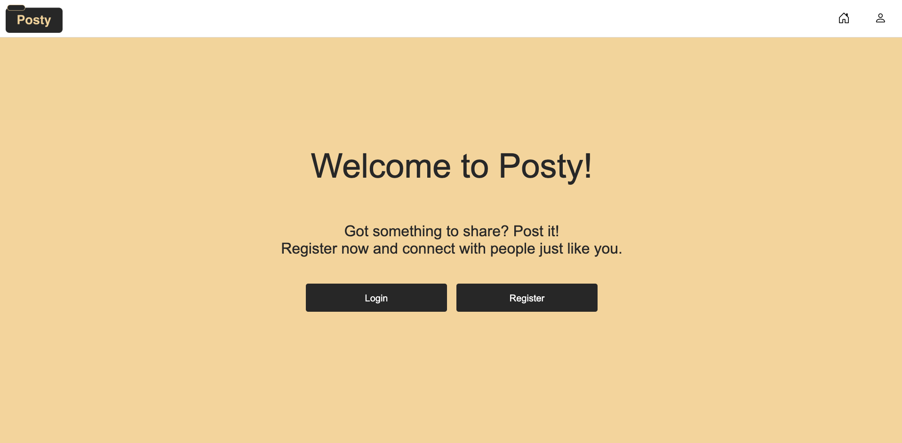

# FED2 JavaScript 2 Course Assignment

Hello there! 👋🏼

My name is Martine Reppesgård Karlsen.

This is my JavaScript 2 course assignment, submitted during my secound year of studying Frontend Development at Noroff School of Technology and Digital Media.

## 🌐 Live website

🎯 Check out the live project: [Posty](https://posty-martir2109.netlify.app/)

## 📸 Website Preview



## 🛠️ Technologies used

- HTML5
- CSS3
- JavaScript Vanilla (ES6 Modules)
- Fetch API
- Netlify (deploymet)

## 🗂️ Project structure

```
├── auth/ # Login and register HTML files
├── footer-links/ # Footer links HTML files
├── post/ # Post HTML files
├── profile/ # Profile HTML files
├── public/ # Static assets (images, favicon, etc.)
├── search/ # Search HTML file
├── settings/ # Settings HTML files
├── src/ # CSS and JavaScript
├── README.md
└── index.html
```

## 📋 What this assignment is about

I was given the task to create a socail media application. We were required allow the users to perfom CRUD operatiosns, meaning Create, Read, Update and Delete on their posts.
In addition, allowing users to follow/ unfollow users, commenting on posts and lastly reacting with an emoji.

### The required features/ user stories

| Feature                | Description                                                              |
| :--------------------- | ------------------------------------------------------------------------ |
| Register new user      | As a user, I can register a new user on the register user page.          |
| Login user             | As a user, I can login as a registered user on the login user page.      |
| Get all posts          | As a user I can view all the posts on the feed page.                     |
| Get post               | As a user, I can view a single post when clicking on a post in the feed. |
| Create post            | As a user, I can create a single post.                                   |
| Edit post              | As a user, I can edit my own post(s).                                    |
| Delete post            | As a user, I can delete my own post(s).                                  |
| Get posts of a user    | As a user, I can view all the posts of a different user.                 |
| Follow / Unfollow user | As a user, I can follow/unfollow other users.                            |
| Search posts           | As a user, I can search through posts using a search bar.                |
| View my own profile    | As a user I can view my own profile.                                     |

### Required pages

1. Login page
2. Register page
3. Posts/ feed page
4. Individual post page
5. User's own profile page

### Requirements

1. You must make use of ES6 modules.
2. At least 3 functions must have JSDocs added to them.
3. You must deploy your app to GitHub pages, Netlify or Vercel.
4. Basic UI must be in place at the very least.
5. You must create a README.md with details how to run your project.

## How to run the project

1. Open project in the terminal

2. Install live-server (if not already installed):

```
npm install live-server --save-dev
```

3. Run the project in your browser:

```
npx live-server
```
